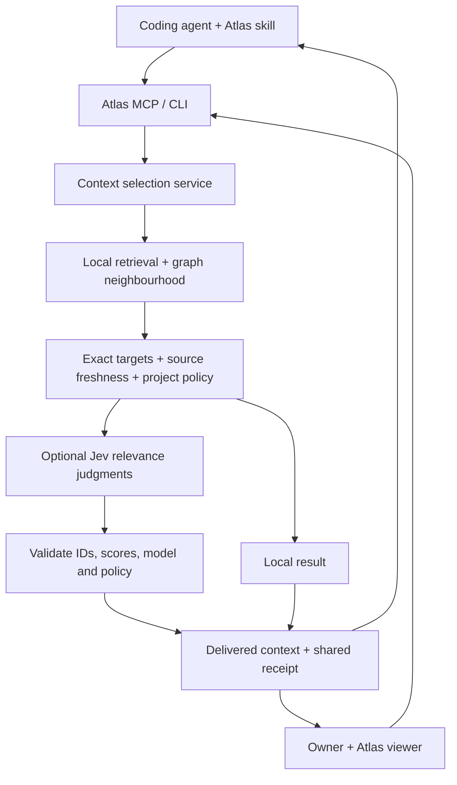

# Jev in Atlas: integration design and adoption plan

Date: 2026-09-19. Branch: `codex/jev-integration`.

## Product decision

Atlas helps coding agents understand a project and helps its owner understand
what the agents are doing. Jev is an optional specialist for bounded judgments
inside that system. Atlas remains the owner of memory, intent, provenance,
execution evidence and user authority.

The first implementation adds optional relevance ranking and explains context selection. Expansion is
conditional on measured value. No live Jev quality, coding success or token
savings are claimed by this branch's offline tests.

A subsequent [live connection check](audits/jev-live-connection-2026-09-19.md)
validated authentication and one real structural shadow comparison. Retrieval
quality and coding benefits remain unmeasured; the legacy saved map still needs
a refresh with source and summary provenance.

## Requirements

| Goal | Source | Acceptance condition |
|---|---|---|
| Streamline AI coding | User | Improve successful task outcomes or reduce total time/tokens without hiding missed evidence |
| Keep the owner deeply informed | User | The owner can inspect the same context receipt used by the agent, including alternatives and limitations |
| High accuracy | User | No model judgment is promoted into structural or execution evidence; uncertainty remains visible |
| Keep agent skills as the interface | Conversation | The Atlas skill and existing MCP/CLI workflow continue to work |
| Preserve existing Atlas work | Existing checkout | Targeted extensions; no replacement of prior modifications or canonical graph data |
| Remain useful without cloud | Existing product direction | Off, unavailable and invalid-provider paths return local results and honest status |

## Responsibility boundaries



Jev does not parse the repository, write code, generate summaries, approve
decisions, alter the graph, execute tests or decide whether a change is verified.
The existing generative provider continues to write summaries and explanations.
The existing verification system continues to calculate evidence-based status.

## Implemented in this branch

### One selection service

`cms/context_selection.py` is shared by MCP queries, CLI queries, task packs
(including intent capture), Ask Atlas and explicit human previews. The base
`CodebaseMemory.query_intent` remains deterministic, so adding Jev does not
silently inject paid calls into background graph construction or feature discovery.

Candidate generation starts with lexical retrieval, preserves literal mapped
paths and backticked exact symbols, and reserves some room for one-hop graph
neighbours. A shortlist is bounded; this is not exhaustive semantic search.
System/component/review objects without source provenance remain local; they
are not sent as though they were source-grounded code candidates.

Jev receives only the task and bounded candidate name, relative path, kind and
summary. Source bodies, approval records, raw history, credentials and arbitrary
graph metadata are not included. Summaries can still contain private information:
this is a real cloud disclosure, not anonymization.

Each candidate gets an independent Noul relevance question. A Choice distribution
is deliberately not used as though it were independent relevance: several code
locations may all matter. Jev produces no explanation. Selection reasons in the
receipt describe Atlas's actual rules rather than inventing model rationale.

### Policy and fallback

| Mode | Outbound Jev request | Delivered results |
|---|---|---|
| Off | None | Local retrieval, with explicit mapped targets retained |
| Shadow | Only with cloud permission and credential | Local result; proposed ranking is separately recorded |
| Assist | Only with cloud permission and credential | Proposed ranking, with explicit targets and one local lead protected for packs of at least three |

The default is off. Cloud modes require both project-local `allow_cloud: true`
and an environment credential. Configuration is strict; misspelled keys fail
closed. Versions are pinned; aliases are rejected. Do not copy a repository's
cloud settings without reviewing them. The policy file is intentionally untracked.

Before inference, source hashes and summary provenance must match the indexed
files for the eligible shortlist. Current project scope, root overrides and
nested ignore rules govern disclosure even when an older graph still contains
excluded files. Feature summaries also require their traced source dependencies
to be permitted; unbounded or unknown provenance stays local. Relevant policy
files are fingerprinted and checked again immediately before the request.
Source, graph identity, settings and processing policy are checked again before
applying a result. Stale source, missing credentials, invalid responses, timeouts,
changing policy and store errors retain local selection and expose a fallback
reason. Missing summary provenance requires a refresh before cloud ranking.

If every relevance estimate is below 0.5, Jev abstains. The local results remain
available **for inspection** and `proposed_ids` is empty. This threshold is an
initial operational rule, not a calibrated promise of accuracy; validate it
against held-out Atlas tasks before relying on it.

The provider has bounded input, output and caller wait, no hidden retries and no
redirects that could forward credentials. A timed-out remote request may still
have consumed provider resources. Zero reported tokens on a failed request is
not proof of zero billing.

### Provenance, caching and receipts

Each receipt identifies the task, source surface, mode, model, policy version,
candidate list, local ranks, proposed ranks, delivered ranks, explicit targets,
freshness checks, relevance estimates, timing, usage and fallback reason.

Receipts are **historical snapshots**. A current hash establishes that the bytes
matched at selection time, not that an AI summary is accurate or the program works.
The evidence fingerprint covers the bounded context and supporting source facts;
it is not a whole-repository verification digest.

The local cache key includes exact task/candidate evidence, source fingerprints,
settings, endpoint, pinned model, prompt version and selection-policy version.
Repeated requests share validated scores. Cached replays report zero new input
and output usage and retain the original usage separately. Project-scoped locking
prevents duplicate in-flight ranking from repeated concurrent requests.

Stores are atomic and bounded: 128 cached decisions and 100 receipts under
`.memory/context/`. Corrupt stores are preserved and reported. Cache eviction and
receipt retention are separate: old chat links can expire and say so explicitly.
If a receipt cannot be saved, the viewer labels it unsaved and still allows the
current result to be downloaded; it does not claim that history was updated.

### Human experience

**Screens → Context decisions** opens `/context`. The page explains the active
mode, lets the owner explicitly preview a task and compares local, proposed and
delivered context. Each candidate shows source freshness, required status and a
decimal relevance estimate without treating it as a correctness percentage.
The owner can inspect all candidates, copy selected references, download the
receipt and revisit saved decisions after reload.

Ask Atlas answers and saved chat entries link to their exact receipt. Local
search links to an explicit preview with the task prefilled. Typing remains
local. Loading history or prefilling a task makes no inference request. Ordinary
navigation to a task-export URL remains local; authenticated viewer requests,
explicit previews and agent calls obey the project policy.

### Agent experience

Existing query results retain their list contract and add small per-result
selection metadata. `get_context_decision(receipt_id)` retrieves the full receipt
only when useful, avoiding a large audit trail in every agent prompt. Task briefs
and Ask Atlas expose a compact receipt, and their downstream evidence remains
separate from ranking judgment.

## Setup and use

1. Copy `.atlas-decisions.example.json` to `.atlas-decisions.json` in the mapped
   project. Leave it off initially. This file is local policy, not an agent skill.
2. Inspect `cms context` and try `cms context "where is response decoding?"`.
3. If the project is permitted to send task text and summaries to TypeSafe, set
   `TYPESAFE_API_KEY` in the process environment, set `allow_cloud` to true and
   choose `shadow`. Restart an already-running Atlas process after changing its
   environment. Never put the credential in this policy file or in a repository.
4. Review real receipts and run labelled retrieval evaluation. Only move to
   `assist` after the acceptance conditions below are met.

The integration does not enable Jev for this checkout automatically.

## Evaluation before adoption

### Layer 1: integration correctness

Offline tests prove request minimization and response validation; off/shadow/
assist behavior; source and policy changes; exact targets; cache invalidation;
sanitized failures; no-match behavior; persistence; HTTP session protections;
MCP/UI/CLI parity; and downstream prompt inclusion. Provider fakes prove plumbing,
not Jev quality. Browser interaction verifies the rendered human flow separately.

### Layer 2: retrieval usefulness

Label a held-out set before looking at Jev results. Start with roughly 45 tasks
across three representative repositories, including exact identifiers, vocabulary
mismatch, architecture questions, cross-file behavior, literal required paths,
ambiguous requests and unanswerable questions. Do not use model output as ground truth.

Input format for `cms context-evaluate cases.json --root <project> --out report.json`:

```json
[
  {"id": "decode-01", "query": "where is response decoding?",
   "expected_ids": ["func:decoder.py::decode_response"], "answerable": true},
  {"id": "absent-01", "query": "where is the nonexistent hardware controller?",
   "expected_ids": [], "answerable": false}
]
```

Use IDs that actually exist in that project's graph. Full validation precedes
any request. The report compares local, delivered and proposed results using
explicit precision/recall denominators, shortlist recall, misses, abstention,
failures, timing and fresh versus cached token usage. Failed cases remain in
totals. It is a retrieval diagnostic, **not coding-effectiveness evidence**.

The built-in report compares the delivered local baseline (lexical results plus
protected exact targets) with the final selection and Jev's proposed selection.
Jev can choose from a larger pool that includes graph neighbours, so improvement
over the local baseline can reflect candidate expansion as well as model ranking.
Shortlist recall reports that larger pool's ceiling; it is not a separate ranked
local comparator. To isolate Jev's contribution, add a deterministic ranking of
the same expanded pool and compare it with Jev on the same held-out labels.
Every case embeds its full receipt, including evidence fingerprint and freshness;
evaluation receipt IDs are not links into the ordinary context-history store.

### Layer 3: coding effectiveness

Run paired unseen coding tasks with the same coding model, Atlas skill, budget,
repository revision, initial memory and acceptance tests. Change only the
selection policy. Score hidden behavioral checks and missed requirements; count
the agent's total tokens, Jev usage, elapsed time and preparation cost. Include
outages and fallback runs in the primary result. Report cold and warm cache
separately, and state how preprocessing cost is amortized across tasks.

### Layer 4: human understanding

Have the owner locate evidence for a change, explain why a file was selected,
identify uncertainty and distinguish suggested from verified behavior. Measure
correct answers and time. Browser automation can establish usable controls; it
cannot establish that people understand the product better.

### Adoption gate

Do not adopt solely because Jev is cheap. Assist must improve delivered relevance
or reduce total effort while preserving required evidence. Coding success and
missed requirements take precedence over token savings. Reject any regression
where uncertain context is presented as verified or an exact target is lost.
Choose numerical improvement thresholds and acceptable miss rates before the
held-out run, reflecting task risk and baseline variability. Recalibrate when
the model, prompt, candidate policy or source representation changes.

## Ultimate integration roadmap

The next product priority is an owner-readable account linking declared intent,
delivered context, changed code, checks performed and remaining unknowns. That
work can proceed alongside retrieval evaluation; it does not depend on adding
more Jev decisions. A context receipt records what Atlas delivered. It cannot
establish which files a third-party agent actually read, what evidence it relied
on or whether a change is correct. Where agent execution logs or test results
are unavailable, the connected account must show that gap explicitly.

| Stage | Status | What it adds | Gate before expanding |
|---|---|---|---|
| Shared context selection and receipts | Implemented, live quality unmeasured | One inspectable selection path for agent and owner | Offline and browser checks; held-out retrieval study |
| Connected work review | Next product priority; parallel to retrieval evaluation | Link declared intent → delivered context → changed code → checks and unknowns in one owner-readable activity view | The owner can distinguish delivered context, observed agent actions, tested behavior and missing evidence |
| Library recommendations | Planned | Select published skills using versioned descriptions, with an explicit none-fit outcome | Better actual skill adoption and no hidden constraints dropped |
| Narrow review triage | Planned | Prioritize suspected contradictions and claims for a stronger model or test | Labelled false-negative analysis; never suppress required checks |
| Background classification | Planned | Suggest bounded feature membership and semantic tags on changed evidence | Provenance and source invalidation; human review for canonical changes |

Library selection must preserve explicitly chosen assets, published versions,
required constraints and conflict reporting. A recommendation is not publication.
Review triage must never assign `verified` or waive checks. Background tags and
feature membership remain model suggestions until validated through the existing
Atlas workflow. No stage hands user approval authority to a relevance model.

## Known limits and trade-offs

- A short candidate set bounds cost but can miss the right code. The receipt
  exposes the set; evaluation must measure this ceiling rather than blaming the
  reranker for unseen evidence.
- The current data representation is brief metadata and summaries. Jev cannot
  infer execution truth from that. Reading more source is a separately governed
  future experiment, not an implicit fallback.
- Exact targets and local lead retention trade some ranking flexibility for
  protection against model mistakes. Evaluate that policy explicitly.
- Features with any stale source in the eligible shortlist fall back locally.
  This conservative behavior can reduce Jev availability in a rapidly changing
  repository; improve freshness maintenance before loosening evidence rules.
- The recorded selection explains which supplied context was delivered. It
  cannot observe what a third-party coding agent actually read or relied on
  afterward without integration with that agent's execution logs.
- The provider is young. API availability, model behavior, quotas and data terms
  can change. The pinned, optional interface makes replacement possible.

## Primary research sources

Checked 2026-09-19:

- [TypeSafe introduction](https://docs.typesafe.ai/introduction): bounded typed decisions, independent parallel questions.
- [HTTP API](https://docs.typesafe.ai/api): state/questions, typed answers and usage.
- [Models](https://docs.typesafe.ai/models): pricing, context budgets, version pinning and data handling.
- [Known limitations](https://docs.typesafe.ai/model-jaggedness/jev-1.13): indirection, distracting context, adversarial content and generation limits.
- [Confidence](https://docs.typesafe.ai/confidence): distribution-based confidence is distinct from probability.
- [Reranking cookbook](https://docs.typesafe.ai/cookbooks/rerank_typesafe): shortlist/rerank separation and recall ceiling.
- [Skill suggestion cookbook](https://docs.typesafe.ai/cookbooks/skill_suggestion): candidate selection with rejection.
- [Privacy](https://typesafe.ai/legal/privacy-policy) and [retention options](https://docs.typesafe.ai/legal): US hosting, no customer-input training, enterprise ZDR separately available.

Vendor demonstrations motivate experiments; they do not establish Atlas results.
